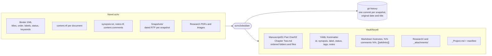
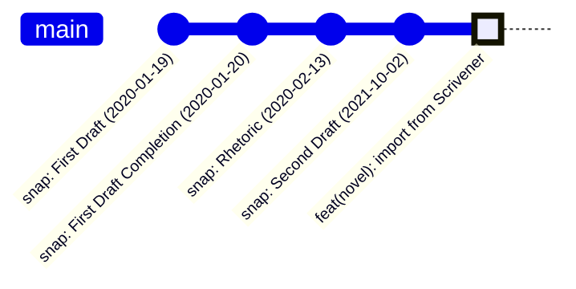

# scrivener-to-obsidian

Turn a Scrivener project into an Obsidian vault **without losing your history.** Binder order, synopses, notes, labels, footnotes, links, research files, and every snapshot you ever took, replayed as git commits with their original titles and dates.

One static binary. Go standard library only. No pandoc, no network, and your `.scriv` package is never touched.

> Part of [Longhand](https://github.com/grassclaw/longhand), a writing studio for Obsidian. This importer writes the Longhand vault spec, so the plugin picks your projects up as-is. It is also useful on its own.

## What happens to your project



## Before and after

| In Scrivener | In your vault |
|---|---|
| Binder folder | Folder, numbered to keep the order |
| Document | `NN Title.md` |
| Folder with its own text | Folder note `NN Title/NN Title.md` |
| Title, created, modified | Frontmatter |
| Synopsis (index card) | `synopsis:` |
| Document notes | `> [!note]` callout at the end of the file |
| Label, status | `label:`, `status:` by name |
| Keywords | `tags:` |
| Custom metadata | `meta:` keyed by field title |
| Footnotes | `[^1]` Markdown footnotes |
| Comments | `%% comment %%` right after the anchored text |
| Internal links | `[[Title]]` wikilinks |
| Web links | `[text](url)` |
| Inline images | `_attachments/`, embedded with `![[...]]` |
| Research PDFs and images | Copied into `Research/` |
| Bookmarks | `bookmarks:` as wikilinks |
| Snapshots | git commits, see below |
| Trash | Skipped unless you ask |

## How snapshots become history

Scrivener keeps each snapshot as a dated RTF file next to the document. The importer sorts every snapshot in the project by date and commits them in order, each one touching only its own document, with the author date set to when you took it. Your current text lands in a final import commit on top.



Each snapshot commit carries trailers a tool can filter on without guessing:

```
snap(Manuscript/01 Part One/02 Chapter Two.md): Second Draft

Snapshot-Title: Second Draft
Snapshot-Doc-Id: 9B2C1F7A-4E63-4D8B-A1F0-2C5E7D9A3B41
Snapshot-Source: scrivener
Word-Count: 2417
```

`git log --grep="Snapshot-Doc-Id: 9B2C..."` lists one document's snapshots across renames. The Longhand plugin shows the same list in a sidebar with side-by-side compare and restore.

## Quick start

```sh
go install github.com/grassclaw/scrivener-to-obsidian/cmd/scriv2obsidian@latest

# see what is inside before you convert anything
scriv2obsidian inspect ~/Dropbox/Apps/Scrivener/Novel.scriv

# convert into a vault folder and replay snapshots as git history
scriv2obsidian convert -out ~/Writing -git ~/Dropbox/Apps/Scrivener/Novel.scriv
```

Open `~/Writing` as a vault in Obsidian. Done.

| Flag | Effect |
|---|---|
| `-out DIR` | Vault directory to write into. Required. |
| `-git` | Initialise a repository if needed and replay snapshots as commits. Needs `git` on PATH. |
| `-poetry` | Treat single paragraph breaks as line breaks, blank lines as stanza breaks. Use for verse. |
| `-no-prefix` | Write `order:` frontmatter instead of numeric file prefixes. |
| `-include-trash` | Export the Trash folder too. |
| `-author "Name <email>"` | Git identity for the commits. Defaults to your git config. |
| `-dry-run` | Print the plan and write nothing. |

Run it as many times as you like; the source package is read-only to the tool.

## What survives and what does not

**Survives:** paragraphs, line breaks, bold, italic, underline, strikethrough, super and subscript, bulleted and numbered lists, tabs, web links, internal links, comments, footnotes, inline images, curly quotes and dashes, every Unicode character.

**Does not:** Scrivener named styles, fonts, colours, alignment, and tables. These are recorded in the manifest as warnings instead of being silently mangled. Scrivener 1 and 2 projects are not read; open and save them in Scrivener 3 first.

## Why another converter

The existing tools export text and folders. None carry snapshots across, and most drop notes, footnotes, and links. This one is built around a small written [vault spec](https://github.com/grassclaw/longhand/blob/main/docs/spec.md) so the output is usable by any tool, with or without a plugin, and it reads RTF itself because pandoc's RTF reader silently deletes hyperlink fields, which is where Scrivener keeps comments and internal links.

## Status

Pre-release. The RTF reader is written; binder parsing, layout, snapshot replay, and the CLI are in progress. The flag table above is the target interface.

## License

MIT.
